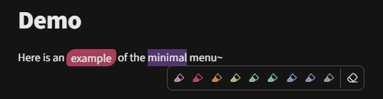
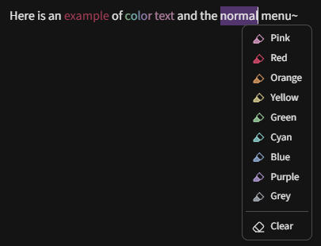
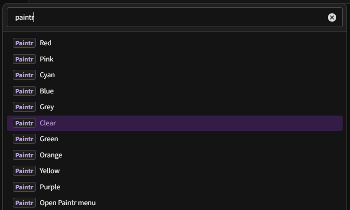

# Paintr

> Highlight or paint text in different colors and styles

<h3 style="display:inline-block">Screenshots</h3>

The aim of this plugin is to support most features of [Highlightr-Plugin](https://github.com/chetachiezikeuzor/Highlightr-Plugin) without interfering with custom `<mark class>` and `<mark style>` set by a theme, snippet or user input. A new option to color text only has also been added.

I have made some additional fixes and plan to add extra styles in the future.

> [!TIP]
> Depending on your prior Highlightr/Painter(KraXen72) setup, [migration is easy](#migrating-from-highlightrpainterkraxen72)

## Improvements over original plugin
### Features
- Better [theme compatability](#compatability)
- Comes configured with Highlightr's default colors
### KraXen72's features
- Added `text-color` higlight option
- Added `minimal` menu style - only show icons in one line (with `title` attributes)
- Smarter selection (adapted from [Smarter MD Hotkeys](https://github.com/chrisgrieser/obsidian-smarter-md-hotkeys))
  - Guide: `Inline code` below signifies the part of the text being selected. `|` signifies a cursor without selection.
    - **Auto-select word:** "hello t`|`here world!" => "hello `there` world!"
    - **Trim selection to nearest word:** "what` is` up?" => "what `is` up?"
    - You are still able to paint a certain part of a word: "h`ell`o" => "h`ell`o"
- Better `Clear` (formerly `Remove higlight`) command
  - Added it to the highlighting menu as well	
  - In settings, you can configure custom CSS selectors to remove alongside any `mark` elements
  - Replaced regex-based approach with a `DOMParser`
- New svg icon (modified lucide highlighter icon)
- Added dynamic highlight preview in settings (shows with your colors)

### Fixes
- Fixed broken `minimal` menu
- Fixed settings preview when uppercase letters exist
- No more native markdown highlight alteration, allowing classic highlights alongside Paintr styles!
- No more global `<mark>` alteration! Paintr only styles its own highlights giving you freedom to use custom `<mark>` tags (Good for [theme compatability](#compatability))
### KraXen72's Fixes
- [Works in Obsidian's Table editor](https://github.com/chetachiezikeuzor/Highlightr-Plugin/issues/90)
- [Removed extra spaces after marks](https://github.com/chetachiezikeuzor/Highlightr-Plugin/pull/40)
- Allows overwriting previous highlights (setting) - similar to this [pull request](https://github.com/chetachiezikeuzor/Highlightr-Plugin/pull/63)
- Highlightr styles now use css variables instead of hardcoded values

### KraXen72's Other
- Cleaned up file structure & move to esbuild instead of rollup
- Removed a bunch of unnecessary code & styles, overall cleanup & rewrite
  - Removed a bunch of custom icons in favor of normal obsidian icons	
  - Removed `wait()` calls (promise + settimeout)	
- Removed dependencies:
  - `pickr` - Replaced with obsidian's native color picker & an alpha slider
- Renamed command ids for consistency
- Rewrote basically the entire plugin lol
- added `"use strict"` to minified code to improve performance

## Migrating from Highlightr/Painter(KraXen72)
> [!WARNING]
> #### Migration Breaking changes
> If you have been using Highlightr or KraXen72's Painter with the `inline-styles` setting active prior to moving to this prepository, your old hightlights made using the plugin will revert to Obsidian/theme/snippet defaults!
>
> Previously `<mark style="background-color:#hex">` or `<mark style="color:#hex">` was used, this caused a conflict between some themes or user set style properties that use the `<mark>` tag.
> This repo uses a blank/dummy prefix to avoid this issue: `<mark style"paintr:;background:#hex">`
>
> Therefore you can mitigate this by adding `paintr;:` after `style="` in your old highlights, but this may be tedious depending on method of replacement.
>
> #### Futher notes:
> 1. `css-class` mode styles now only apply when the class matches the pre-existing prefix: `hltr-`. 
> This means your highlights while this setting was on should migrate perfectly.
>
> 2. if you used Obsidian's native highlight functions, or manually typed `<mark>` without the mentioned class prefix, or `==markdown-style==`, highlights, these will revert to Obsidian/theme/snippet defaults.

This plugin uses `css-style` by default, but check the [section below](#css-classes-vs-inline-styles-which-should-you-choose) on which is right for you.

With that out of the way, if you've previously used the highlightr plugin, you can migrate your settings by copying:
- `<vault>/.obsidian/plugins/highlightr-plugin/data.json` =>
- `<vault>/.obsidian/plugins/paintr/data.json`
~~Note - this will break settings page previews atm~~ - fixed!

Then, disable & enable the Paintr plugin.
Make sure to check settings have sucessfully migrated, and if they have, feel free to uninstall highlightr.

## css-classes vs. inline-styles: which should you choose?
The settings allow you to select between two highlight styles, `css-classes` and `inline-styles`. 
Here is their comparison:
#### css-classes
- Uses `<mark class="hltr-colorname">content</mark>`
- Paintr plugin injects a stylesheet which colors these
- 👍 More flexible:
  - Re-defining a color with the same name will update existing highlights
  - Changing the highlight style will update all existing highlights as well

Unless you plan on frequently exporting your notes outside of obsidian, use Obsidian Publish or edit notes in externally, pick this option. It's much more flexible.
Even if you plan to someday export your notes, you can always write a simple script to convert the `<mark>` elements to whatever you want, or add a custom stylesheet that will add back their coloring.
In a future plugin release, there will likely be an option to generate this stylesheet for usage outside of obsidian.

#### inline-styles
- uses `<mark style="color:paintr:;#hex">content</mark>` or `<mark style="paintr:;background-color:#hex">content</mark>`
- still dependent on obsidian/external stylesheets for any other styling, like rounded corners, padding, etc.
- bakes the color in the highlight: if you change a color in settings, previous highlights will stay the same
- changing highlight style later will not fully affect existing highlights
  - `background-color` highlights will not turn into `color` (`text-color` in settings) and vice versa.
- slightly easier to use outside of obsidian

Some people might prefer this method.
Feel free to experiment with them to find the one best for your use-case.

## I can't see the color previews in context menu

If your context menu looks like this and not like the one in the screenshots above, in Obsidian settings, `Appearance` > `Advanced`, turn off `Native menus`.

## Compatability
#### Prism theme
When using `css-classes` mode, prism styling may add to or override some styles (depending on your highlight settings for Prism within Style Settings), if you wish to fix this behaviour:
1. Open `.obsidian/themes/Prism/theme.css`
2. replace all `mark[class]` with `mark[class]:not([class^="hltr-"])`
This will allow both Prism classes and Paintr classes to be used without interfering with one another.
#### Other themes
If conflict occurs, they will hopefully be solved in a similar way as above. 
The css selector may be `mark[class]` as above, simply `mark` alone, or similar. 
The goal is to append `:not([class^="hltr-"])` after the all mark selectors.
Example: `mark:not([class^="hltr-"])`

## Credits
- [Highlightr-Plugin](https://github.com/chetachiezikeuzor/Highlightr-Plugin) released under [MPLv2](./LICENSE) license. support: [ko-fi](https://ko-fi.com/chetachi)
  - for most of the original source code (most has been rewritten)
- [Smarter MD Hotkeys](https://github.com/chrisgrieser/obsidian-smarter-md-hotkeys) released under [MIT](https://github.com/chrisgrieser/obsidian-smarter-md-hotkeys/blob/master/LICENSE) license. support: [ko-fi](https://ko-fi.com/pseudometa)
  - for smart text modification logic

## What this plugin doesen't try to be
This plugin is for coloring/highlighting text.
It doesen't try to provide a comprehensive formatting toolbar/experience. 
Out of scope: [Modal highlighting (highlighting brushes)](https://github.com/chetachiezikeuzor/Highlightr-Plugin/issues/82)
Use this: [obsidian-editing-toolbar](https://github.com/PKM-er/obsidian-editing-toolbar)
